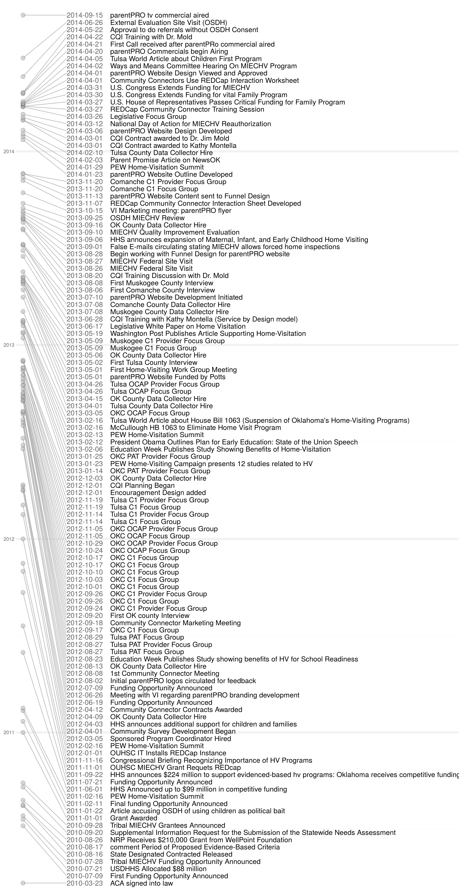

Aim 1b
=================================================
This report covers Aim 1b: **Develop timeline and analytic covariates that chronicle major program events**

 i.	Record successful establishment of a centralized referral/triage system
 ii. Assess frequency of home visitation coalition meetings
 iii.	Record the successful establishment of Connectors in each county
 iv. Record frequency of Connector initiated network meetings 
 v.	Record number of Memorandums of Agreement and/or Understanding between local services


<!--  Set the working directory to the repository's base directory; this assumes the report is nested inside of two directories.-->


<!-- Set the report-wide options, and point to the external code file. -->

<!-- Load the packages.  Suppress the output when loading packages. --> 


<!-- Load any Global functions and variables declared in the R file.  Suppress the output. --> 


<!-- Declare any global functions specific to a Rmd output.  Suppress the output. --> 


<!-- Load the datasets.   -->


<!-- Tweak the datasets.   -->


## Timeline of Oklahoma's [MIECHV](http://www.ok.gov/health/Child_and_Family_Health/Family_Support_and_Prevention_Service/MIECHV_Program_-_Federal_Home_Visiting_Grant/MIECHV_Program_Resources/index.html) Progress

 

# Session Information
For the sake of documentation and reproducibility, the current report was rendered on a system using the following software.


```
Report rendered by Will at 2014-10-16, 20:40 -0500
```

```
R version 3.1.1 Patched (2014-09-27 r66695)
Platform: x86_64-w64-mingw32/x64 (64-bit)

locale:
[1] LC_COLLATE=English_United States.1252  LC_CTYPE=English_United States.1252    LC_MONETARY=English_United States.1252
[4] LC_NUMERIC=C                           LC_TIME=English_United States.1252    

attached base packages:
[1] stats     graphics  grDevices utils     datasets  methods   base     

other attached packages:
[1] lubridate_1.3.3    ggplot2_1.0.0      RColorBrewer_1.0-5 scales_0.2.4       plyr_1.8.1         knitr_1.7         

loaded via a namespace (and not attached):
 [1] colorspace_1.2-4 digest_0.6.4     evaluate_0.5.5   formatR_1.0      grid_3.1.1       gtable_0.1.2    
 [7] htmltools_0.2.6  MASS_7.3-34      memoise_0.2.1    munsell_0.4.2    proto_0.3-10     Rcpp_0.11.3     
[13] reshape2_1.4     rmarkdown_0.3.3  stringr_0.6.2    tools_3.1.1      yaml_2.1.13     
```
