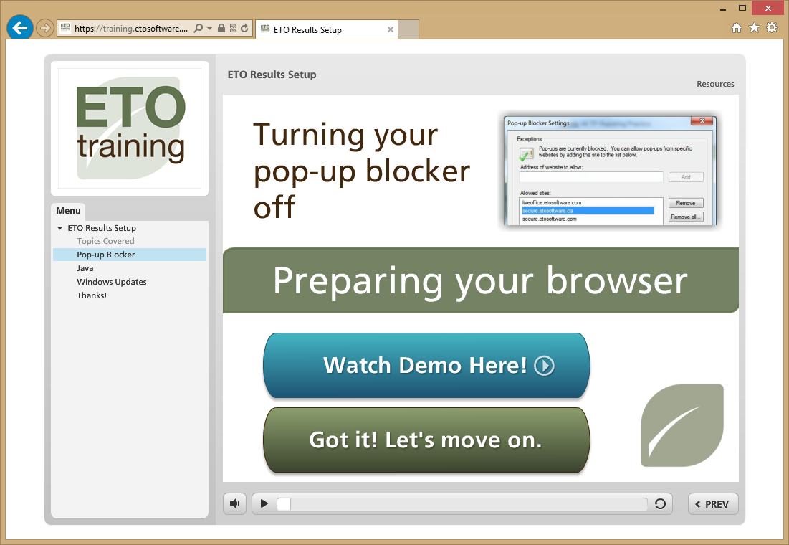
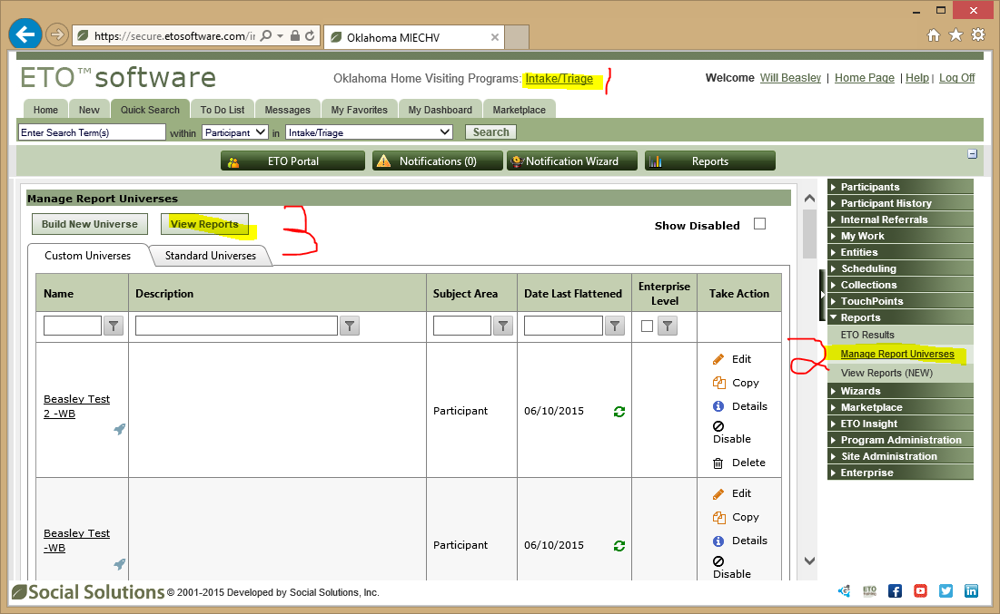
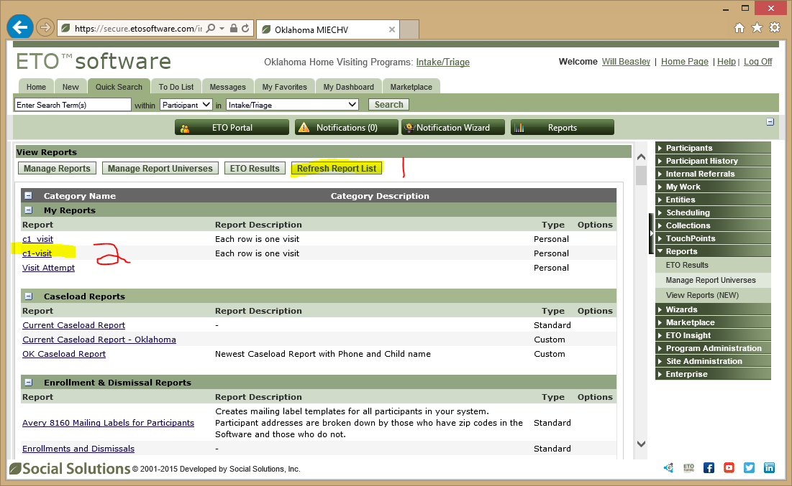
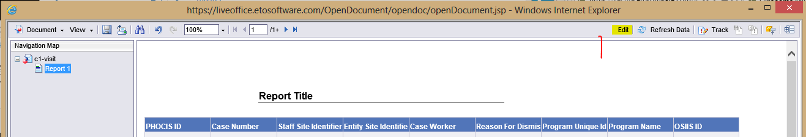
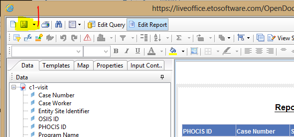

Extract Report Data as CSV
====================================
1. **Prepare Your Computer**: The first time you use a computer, run the [online setup wizard](https://training.etosoftware.com/TrainingVideos/ETOResultsSetup/story.html) provided by ETO.  There are lots of little things that need to be configured
    

2. **Log On**: Log on with you OSDH username and password (not your OUHSC LDAP credentials).

3. **Open Report Menu**: Change the dropdown box to `Intake/Triage` (see the #1 in screenshot).  Next, open `Reports` -> `Manage Report Universes` (see #2 in the screenshot).  Then click `View Reports` (see #3 in the screenshot).
    

4. **Open Report**: Click `Refresh Report List` if there are any recently added reports (see the #1 in screenshot).  Next, find and click the desired report (see #2 in the screenshot).  Java loads on your local machine, so it's a likely failure point.  If successful, it takes ~15 seconds.
    

5. **"Edit" Report**: Click `Edit`.  You don't really want to edit the report, but this is the only way to export the data as a csv.  Another Java thing takes ~15 seconds.  Then a "SAP Business Object" thing load for another 10.
    

6. **Export CSV**: Click the tiny down arrow next to the floppy disk icon in the top left.  Then `Save to my computer as...` -> `CSV` -> `Save`.  This opens a 'Save Document' dialog box.  Navigate to the root of this repository on your computer (MReportingPublic), and then save as `./DataPhiFreeCache/Raw/C1/c1-visit.csv`.  

    The old style of dialog box is used, so you can't just paste the directory directly in a top text box. There are two timesavers possible.  The first is to save a shortcut in the directory that opens by default.  The second is to paste the complete string in the "File name:" box, which is typically used to accept only a filename, not the full path (eg, `D:\Projects\Ouhsc\Bbmc\MReportingPublic\DataPhiFreeCache\Raw\C1\c1-visit.csv`).
    
