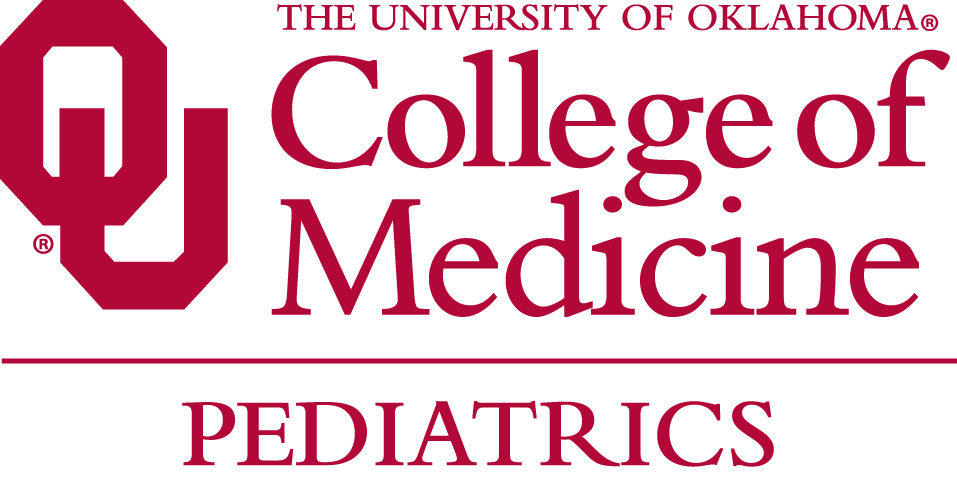
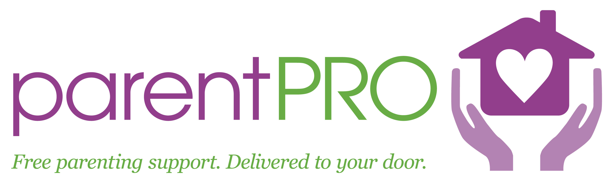

***
***
# Investigators

***
## OUHSC Pediatrics
The [Pediatrics Dept](http://www.oumedicine.com/pediatrics) of the University of Oklahoma [Health Sciences Center](http://www.ouhsc.edu/) serve as the external investigators in the projects described on this site.  Current investigators are members of the [BBMC](http://ouhsc.edu/BBMC/) (Biomedical and Behavioral Methodology Core) and [CCAN](http://www.oumedicine.com/pediatrics/department-sections/developmental-behavioral-pediatrics/center-on-child-abuse-and-neglect) (Center for Child Abuse and Neglect).

The Pediatrics Dept has been involved with Home Visiting research for over a decade.  The investigators of the research featured on this site include David Bard, Jane Silovsky, Lana Beasley, [Will Beasley](https://www.researchgate.net/profile/William_Beasley2), Debt Hecht, and Mark Chaffin.

***
## OSDH

***
***
# Stakeholders

***
## parentPRO
[parentPRO](http://parentpro.funnelstaging.com/) is a free service that connects families to parenting programs that take place in the participant's home.  These programs are designed to strengthen families and help Oklahoma's children grow healthy and strong by reducing the stress that comes with being a parent. The goals of the programs are to promote maternal and child health, well-being, family stability, family safety and economic self-sufficiency.

When you call parentPRO, you will be matched to the program that best fits your needs, strengths, and qualifications. Since the programs take place in the individual's home, the services are convenient for families. They don't have to worry about transportation or childcare.

***
## Smart Start Oklahoma
[Smart Start Oklahoma](http://www.smartstartok.org/)

***
## OHCA

Oklahoma's Medicaid program, known as SoonerCare, is administered by the [Oklahoma Health Care Authority](http://www.okhca.org/) (OHCA).  SoonerCare works to improve the health outcomes of Oklahomans by ensuring that medically necessary benefits and services are responsive to the health care needs of our members. Qualifying Oklahomans include certain low-income children, seniors, the disabled, those being treated for breast or cervical cancer and those seeking family planning services. [Insure Oklahoma](http://www.insureoklahoma.org/) assists qualifying adults and small business employees in obtaining health care coverage for themselves and their families. OHCA strives to educate and engage our one-million plus members regarding personal responsibilities for their health services utilization, behaviors, and outcomes in partnership with a state-wide network of 44,300 providers (FY2013). For more information, visit [www.okhca.org ](http://www.okhca.org/).

