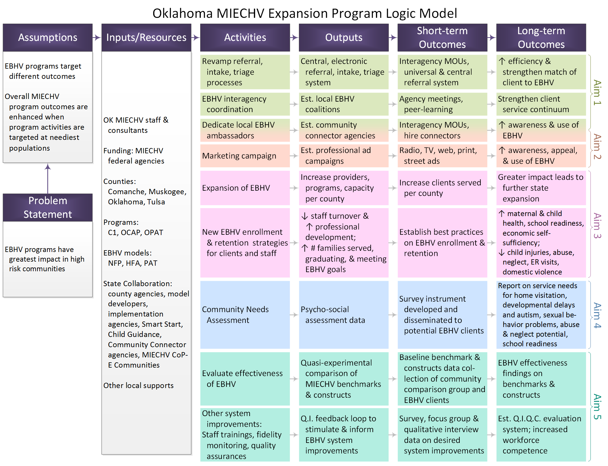

***
***
# Materials for the Grant Funded in 2011

Project Duration: 2011-2015

> Evaluates MIECHV expansion and enhancement of Evidence-based Home Visitation programs in four Oklahoma counties.

This page contains the material for 2011's funded proposal, [HRSA/ACF D89MC23154](https://perf-data.hrsa.gov/mchb/DGISReports/Abstract/AbstractDetails.aspx?Source=TVIS&GrantNo=D89MC23154&FY=2012): "OUHSC CCAN Independent Evaluation of the State of Oklahoma Competitive Maternal, Infant, and Early Childhood Home Visiting (MIECHV) Project."

***
***
# Resources and Files
Understanding of this proposal may benefit from the following resources: 

 * [Expansion Program Logic Model](./funding_2011a_logic_model.png)

***
***
# Aims of *Evaluation*
Our *evaluation* has five aims (not to be confused with the four goals and objectives of the *service*, desribed below).  This [project's research page](./research_2011a.html) contains more details and reports.

 * **Aim 1** [Systems Coordination](./research_2011a.html#systems-coordination): Evaluate the impact of existing and developing coordination between EBHV programs and other support services.
 * **Aim 2** [Program Marketing](./research_2011a.html#program-marketing): Inform, develop, and evaluate the outreach efforts of MIECHV-funded marketing.
 * **Aim 3** [Client Enrollment and Retention](./research_2011a.html#client-enrollment-and-retention): Inform, develop, and evaluate new methods for engagement and retention of clients in EBHV services.
 * **Aim 4** [Service Need](./research_2011a.html#service-need): Evaluate the overall need for child and family services within each community.
 * **Aim 5** [HV Effectiveness and Improvement](./research_2011a.html#hv-effectiveness-and-improvement): Establish a quality improvement and control system and evaluate effectiveness of the home visitation and early childhood services continuum.

***
***
# Goals and Objectives of *Service*

The *service* aspect of the project (not to be confused with the *evaluation*, desribed above) has four primary goals.

The purpose of the MIECHV Grant is to strengthen the system of early childhood home visiting services to improve outcomes for at-risk families who reside in communities that were identified in a statewide needs assessment. Counties identified were Comanche, Muskogee, Oklahoma, and Tulsa Counties.

## Goal 1
Develop a sustainable, MIECHV home visitation program infrastructure of selected, multiple models matching consumer needs to program model goals.

 * **Objective 1**: Utilizing the completed Needs Assessment, choose evidence-based home visitation models for implementation in Oklahoma's at-risk communities. This objective was completed during Year 1. Models chosen include Nurse-Family Partnership, Healthy Families America, and Parents as Teachers.
 
 * **Objective 2**: Develop home visitation coalitions in each at-risk community to assist with coordinating home visitation services and to assure families are connected with the appropriate home visiting program. This objective was initiated during Year 1 and will continue throughout the duration of the project.
 
 * **Objective 3**: Establish a central intake system in each at-risk community so that potential participants and other community service organizations can easily connect with home visitation programs. This objective was developed during Year 1 with improvements made as needed throughout the duration of the project.

 
## Goal 2
Scale-up State evidence-based home visitation program activities by adding home visitors, maintaining fidelity to model protocols, and provide higher quality and more stable home visitation service.

 * **Objective 1**: Hire qualified home visitors. This objective was initiated during Year 1 for those implementing the Nurse-Family Partnership Model. It will be initiated during Year 2, after the bid process has been completed, for those implementing Healthy Families America and Parents as Teachers.
 
 * **Objective 2**: Provide model specific training and technical assistance to home visitors as well as trainings on specific topics. Training that will be required for all home visitors, regardless of model, is in the planning phase during Year 1 with implementation beginning in Year 2.
 
 * **Objective 3**: Conduct routine site visits, record audits and shadow visits to assure delivery of high quality services and implementation of best practice standards. Routine monitoring will be conducted annually as each model is implemented.

## Goal 3
Improve outcomes in required MIECHV Grant benchmark and their corresponding constructs.

 * **Objective 1**: Develop or purchase a data collection system that will support the program evaluation needs of all implemented models. The procurement process for purchasing an appropriate data collection system was initiated during Year 1.
 * **Objective 2**: Develop and or select data collection tools that can be incorporated in the practice and evaluation of all implemented program models. Development and selection of data collection tools for evaluation will be completed during Year 1.
 * **Objective 3**: Routinely analyze and report data findings related to the MIECHV Grant benchmarks/constructs as required by the MIECVH Grant. Data reporting and analysis will begin as home visiting models are implemented.

## Goal 4
Develop or enhance implementation of existing statewide and county level collaborations and partnerships to effectively implement and sustain MIECHV Program.

 * **Objective 1**: Establish a home visitation coalition in each at-risk community for better coordination of services, ease in making referrals and increased sharing of information. This objective was initiated during Year 1.
 
 * **Objective 2**: Utilize the state Home Visitation Leadership Advisory Coalition, the Interagency Child Abuse Prevention Task Force and the Early Childhood Advisory Council as partners and collaborators. This objective was initiated during the writing of the grant and will continue through the duration of the grant.
 
 * **Objective 3**: During Year 1 assure each community has a Community Connector dedicated to marketing the home visitation programs, connecting potential participants to programs and facilitating opportunities for home visitation professionals to meet together with other community service providers.

***
***
# Logic Model

# Additional Information
 * For more information about the proposal, please see the
[official HRSA page](https://perf-data.hrsa.gov/mchb/DGISReports/Abstract/AbstractDetails.aspx?Source=TVIS&GrantNo=D89MC23154&FY=2012).
 * For more information about the outcomes, please see the project's [Research Products](./research_2011a.html) page.

***
***
# Collaborators and Stakeholders
?David, do you want a list of people like OSDH, OUHSC, OHCA... Anyone else?

 * [OUHSC Pediatrics](./about_collaborators.html#ouhsc-pediatrics)
 * [OSDH](./about_collaborators.html#osdh)
 * [OHCA](./about_collaborators.html#ohca)
