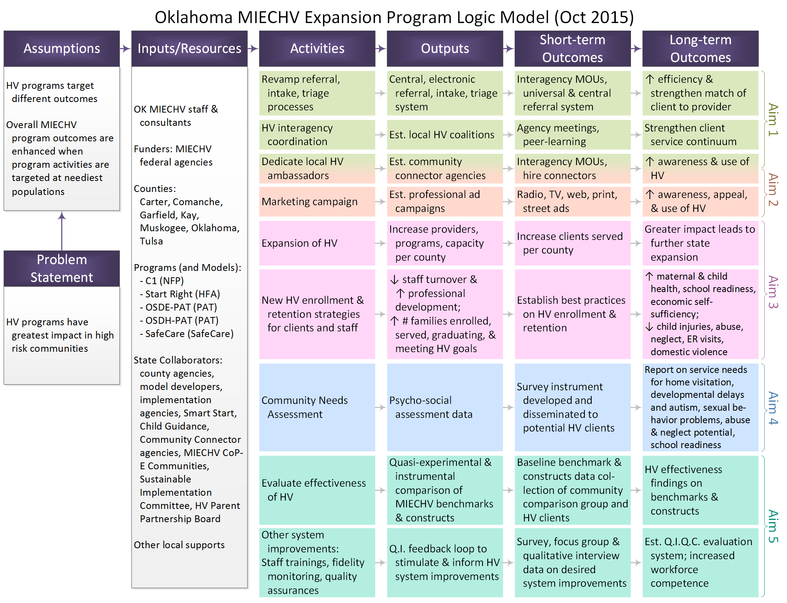

***

# Materials for Project Proposed in 2014

Project Duration: 2015-2016?

> Tag line?

This page contains material related to the proposal to be reviewed in late 2014, ?Add a reference/hyperlink here?.

?Add a project title here?

# Resources and Files
Understanding of this proposal may benefit from the following resources: 

 * [Appendix A: Benchmark Summary](./funding_2014a_benchmark_summary.pdf)
 * [Appendix B: Survey Measures](./funding_2014a_survey_measures.pdf)
 * **Appendix C: Donna's Crosswalk Measures:** --Need this--
 * [Logic Model](./funding_2014a_logic_model.pdf)
 * **Thomas's timeline:** --Need this--

# Goals and Objectives
?

***
# Logic Model

# Additional Information
 * For more information about the RFP, please see the official HRSA page at ?link?.
 * The proposal is due in October 2014, so check in with us a few months after that.

***
# Collaborators and Stakeholders
?David, is OHCA involved in the extension?  Is there anyone new?

 * [OUHSC Pediatrics](./about_collaborators.html#ouhsc-pediatrics)
 * [OSDH](./about_collaborators.html#osdh)
 * [OHCA](./about_collaborators.html#ohca)
