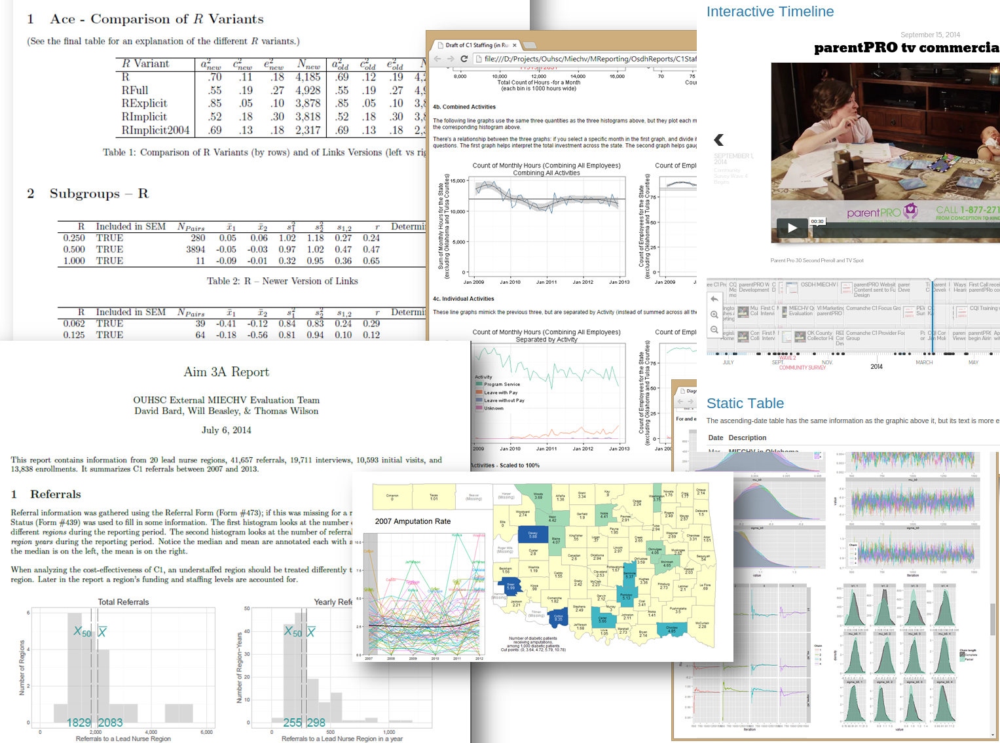

### Welcome

Welcome to Oklahoma's MIECHV Evaluation. This public-facing site provides aggregate reports and de-identified datasets to communicate the results of Oklahoma's MIECHV evaluation and distribute material to assist similar efforts.

"The Maternal, Infant, and Early Childhood Home Visiting project supports pregnant women and families and helps at-risk parents of children from birth to kindergarten entry tap the resources and hone the skills they need to raise children who are physically, socially and emotionally healthy and ready to learn" ([HRSA, 2015](http://mchb.hrsa.gov/programs/homevisiting/)). Oklahoma's current focus is to expand services and explore the effectiveness of different approaches.  For more details about the project, please see our [timeline](http://ouhscbbmc.github.io/MReportingPublic/reports/Aim1B.html) and [list of reports](http://ouhscbbmc.github.io/MReportingPublic/research-2011a.html).

This site is structured into primary categories, each with nested subcategories.  Please navigate this site with the dropdown boxes at the top of the page.

 * **Research Products** are a gateway to the reports used in our CQI and evaluation.
 * **Other Products** contains software and datasets that mgiht be helpful to researchers pursuing similar questions.
 * **Funding** pages describe current and previous funding proposals.  A proposal is categorized under the year it was submitted.
 * **About** covers the collaborators and stakeholders involved in Oklahoma's overall MIECHV services and evaluations.

If you have any questions or comments, feel free to post them below. --*Oklahoma's MIECHV team*

   
  <a class="btn btn-info btn-xs" href="https://github.com/OuhscBbmc/MReportingPublic/tree/gh-pages">
    <i class="fa fa-github"></i> Source Code
  </a>

